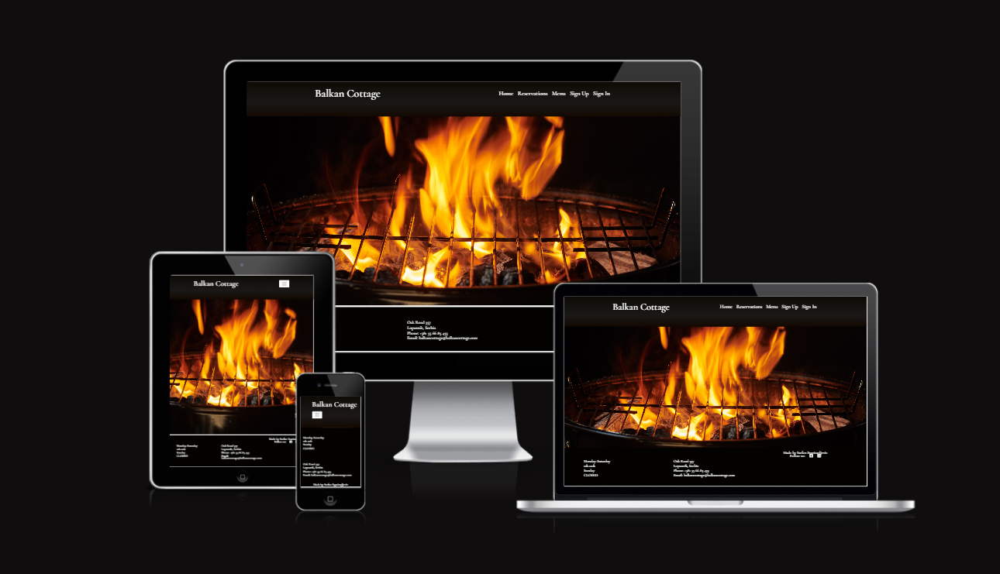
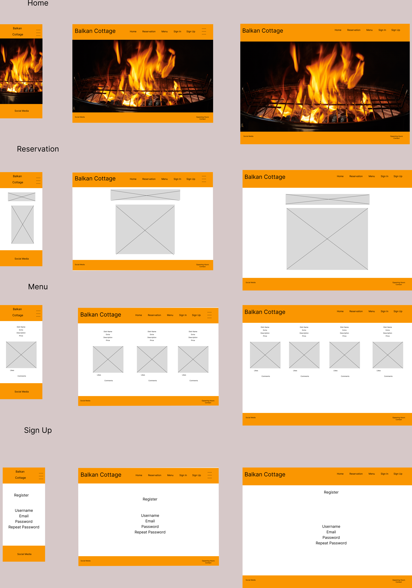

# Balkan Cottage

__Developed by Stefan Stanisavljevic__

## Table of Contents
- [About](#about)
- [User Experience](#user-experience(ux))
- [Site Owner Goals](#site-owner-goals)
- [Design](#design)
- [Technologies Used](#technologies-used)
- [Features](#features)
- [Validation](#validation)
- [Testing](#testing)
- [Bugs](#bugs)
    - [Fixed Bugs](#fixed-bugs)
- [Heroku Deployment](#heroku-deployment)
- [Credits](#credits)

### About
This website is made for fictional restaurant called Balkan Cottage. it is my 4. project in the Code Institute full stack developer program.
The platform caters to individuals seeking a delightful and enjoyable dining experience at a restaurant. Alongside relishing delectable cuisine and a comfortable ambiance, users can leverage the website's features, including account registration and reservation management. This empowers customers to conveniently create, modify, and oversee their reservations through the online platform.
### User Experience(UX)
  #### First time visitor goals:
  - As a first time visitor I can familiar with local balkan kitchen.
  - As a first time visitor I can find out what kind of food is served at the restaurant.
  - As a first time visitor I can find information about how to make a reservation at the restaurant.
#### Returning visitor goals:
  - As a returning visitor I can create an account so I can make a reservation online.
  - As a returning visitor I can view the menu to see if has changed.
 #### Frequent User Goals
  - As a frequent visitor I can login and find my current bookings.
  - As a frequent visitor I can change or cancel my reservation in the login page.
### Site owner Goals
  - As a site owner I want to create the menu which is displayed on the menu page
  - As a site owner I want to see all the site users
  - As a site owner I want to manage the booking(delete) and view extra wishes/requests from the customers
### Design
  #### Wireframes 
  
  #### Colors  
  - The main colors are a mix of black and white with the home page having a fire grill with powerfull orange/red/yellow colors to add some contrast. This is intented to make the user feel comfortable and warm when visiting the website. 
  #### Fonts 
  - The fonts are chosen to be in retro fashion. 
  #### Images 
  - The selected images are selected to boost the apetite and and the feeling of fine atmosphere in the restaurant. 
### Technologies Used
#### Languages
   - Python
   - HTML5
   - CSS3

#### Frameworks, Libraries, Programs

- External Packages
  - [cloudinary](https://pypi.org/project/cloudinary/1.29.0/) 
  - [dj-database-url](https://pypi.org/project/dj-database-url/0.5.0/) 
  - [dj3-cloudinary-storage](https://pypi.org/project/dj3-cloudinary-storage/0.0.6/) 
  - [Django](https://pypi.org/project/Django/3.2.14/) 
  - [django-allauth](https://pypi.org/project/django-allauth/0.51.0/)
  - [gunicorn](https://pypi.org/project/gunicorn/20.1.0/)
  - [psycopg2](https://pypi.org/project/psycopg2/2.9.3/) 

#### Programs & Tools

- [Google Fonts:](https://fonts.google.com/)
  - Was used to to incorporate font styles.  
- [Bootstrap](https://getbootstrap.com/)
  - Was used to create the front-end design.
- [GitPod:](https://gitpod.io/)
  - Gitpod was used as IDE to commit and push the project to GitHub.
- [GitHub:](https://github.com/)
  - Was used for all storing and backup of the code pertaining to the project.
- [Figma:](https://www.figma.com/)
  - Was used to create wireframes
### Features
#### Navbar

- The navbar shows all the sections that the user can enter and provides a quick and easy means of navigating the site. The link to make a booking is enlarged to make it extra easy to find and use.  
#### Home

- The Home page makes the first impression of the site and shows the existing features for visitors and logged in users.
#### Menu

- The menu section comes with images and descriptions of some the meals available at the restaurant.
#### Contact and oppening hours 

- The contact section includes all the necessary information about the restaurant that the visitor may need to know about.
#### Account signup/login

- The account pages where the user can create an account in order to make a registration as well as login as an existing users.  
#### Reservation Page

- In the reservation page the user can make a reservation using the form and submit it. It will then show up in the users's my reservation page.
#### My reservations with update and delete reservation

- Here the the user can view the list of his reservation and update/delete them.

### Testing
[Testing](/ReadMe%20Documentation/Testing.md)
### Bugs

#### Fixed Bugs
* When deploying the error " at=error code=H10 desc="App crashed" method=GET path="/" " occured which caused the homepage to crash. The problem was in the config vars
  CLOUDINARY_URL which by mistake contained invalid values. This bug was resolved by correcting the CLOUDINARY_URL .
* Beside the content, code was also displayed on menu.html page. The bug was fixed by adding {{ variable_name | safe }}
* @method_decorator(login_required) added.  
* Get and post functions to create reservation. Using this inbuilt function instead of custom ones. 
* https://stackoverflow.com/questions/2035288/getting-a-list-of-errors-in-a-django-form

#### Unfixed Bugs
* There are no unfixed bugs that I am aware of.

### Heroku Deployment

The project was deployed using Heroku.

* Steps for deployment
    1. Create a new Heroku app
    2. Create database in Heroku using postgresSQL
    3. Connect the Heroku App to the Github Repository
    4. Add the necessary variables in Config Vars
    5. Click the Deploy button

### Credits

* I want to express my gratitude to my menthor Rohit for his support, patience and guidance during this project
* Stackoverflow community
* Django documentation
* Code Institute I think therefore I blog project
* Code Institute Task Manager project
* [Erik HGM](https://github.com/ErikHgm/FireHouse-Restaurant-Project) for ideas and some ReadMe content.

#### Images
Backgound image <a href="https://www.freepik.com/free-photo/grill-background-barbecue-fire-grill-close-up-isolated-black-background_13012809.htm#query=bbq&position=5&from_view=search&track=sph">Image by jcomp</a> on Freepik

Pljeskavica dish Image by <a href="https://www.freepik.com/free-photo/high-angle-burger-meat-grill_12656694.htm#query=grilled%20burger&position=0&from_view=search&track=robertav1_2_sidr">Freepik</a>

<a href="https://www.freepik.com/free-photo/lule-kebab-with-onions-pickles_7303084.htm#query=cevapi&position=1&from_view=search&track=sph">Image by KamranAydinov</a> on Freepik

#### Acknowledgements
  - The tutor support team at Code Institute for their support.
  - My Code Institute Mentor for feedback and suggestions.
  - The Code Institute Slack community.

  [Back to top](#table-of-contents)